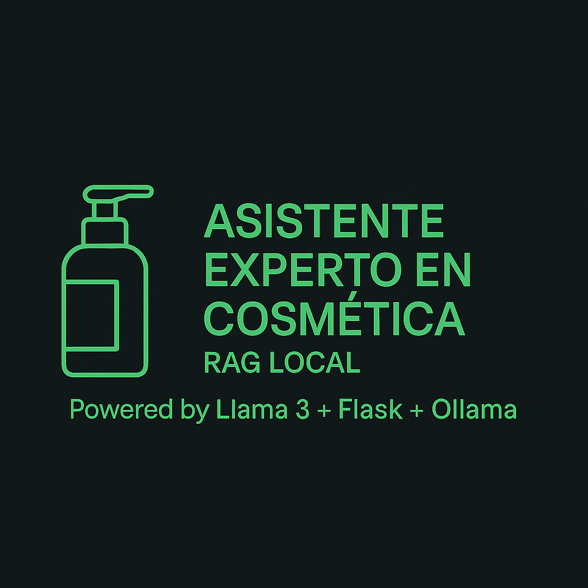

# 🧴 Asistente Experto en Cosmética (RAG Local)


<p align="center">
  
</p>

---

<details open>
<summary>🇪🇸 Español</summary>

Un chatbot conversacional avanzado que actúa como **experto en cosmética**, combinando el poder de la **arquitectura RAG (Retrieval-Augmented Generation)** con un **modelo de lenguaje Llama 3 (8B)** ejecutado totalmente **en local sobre GPU NVIDIA**.

💡 **Ventaja principal:**  
Toda la inteligencia artificial se ejecuta en **hardware local**, sin depender de APIs externas

---

## 🧠 Arquitectura del Proyecto

El sistema se compone de **cuatro módulos principales**, que se comunican localmente:

| Componente | Descripción |
|-------------|-------------|
| **Frontend (`index.html`)** | Interfaz web para interacción por texto y voz (TTS/STT mediante APIs nativas del navegador). Mantiene el historial de conversación. |
| **Backend (`app.py`, Flask/Python)** | Orquestador principal. Recibe preguntas, consulta la base RAG, construye el *prompt* aumentado y lo envía al modelo LLM. |
| **Base de Conocimientos (`db_cosmetica.db`)** | Base SQLite con productos extraídos mediante *web scraping*. |
| **Motor LLM (Ollama + Llama 3)** | Servidor local que ejecuta Llama 3 (8B) acelerado por GPU (ej. RTX 3070). |

---

## ⚙️ Requisitos del Entorno

### 🧩 Software Base

- **Python 3.9+**
- **Ollama** (instalado y configurado para GPU NVIDIA)
- **Modelo Llama 3 (8B)** descargado localmente:
  ```bash
  ollama run llama3:8b
  ```
- **SQLite3 CLI** (para depuración de la base de datos)

### 🐍 Dependencias de Python

Instala las librerías requeridas en tu entorno virtual:
```bash
pip install flask flask-cors requests beautifulsoup4
```

---

## 🚀 Inicio Rápido

Ejecuta los siguientes pasos en **dos terminales**:

### 🖥️ Terminal 1 – Iniciar el motor LLM
```bash
sudo systemctl start ollama
# Alternativa manual:
# ollama serve
```

### ⚙️ Terminal 2 – Iniciar el backend Flask
```bash
source venv/bin/activate
python app.py
```

### 🌐 Navegador – Iniciar el frontend
Abre directamente el archivo `index.html` (Chrome o Edge recomendado)  
y comienza a conversar con el asistente.

---

## 🧭 Guía de Configuración Paso a Paso

### **1. Inicializar el Motor LLM (Ollama)**
```bash
sudo systemctl start ollama
# o:
# ollama serve
```

### **2. Crear la Base de Conocimientos (RAG)**
1. Asegúrate de tener el archivo `product_urls.txt` con las URLs.  
2. Ejecuta el scraper para poblar la base de datos:
   ```bash
   python scraper_cosmetica.py
   ```

Esto generará `db_cosmetica.db` con los productos, descripciones e ingredientes.

### **3. Iniciar el Backend**
```bash
python app.py
```

### **4. Iniciar el Frontend**
Abre `index.html` y prueba con una pregunta como:  
> “¿Qué contiene el sérum de ácido hialurónico?”

---

## 🧩 Depuración Común

| Síntoma | Posible causa | Solución |
|----------|----------------|-----------|
| **Error 500** | Fallo interno en `app.py` | Revisa el *traceback* en la terminal |
| **“Servidor no responde”** | Flask no está activo | Ejecuta nuevamente `python app.py` |
| **“HTTP Error 404 (Ollama)”** | El modelo no está cargado | Comprueba con `ollama list` |
| **Sin voz (TTS)** | Bloqueo del navegador o idioma incorrecto | Asegura que `utterance.lang = 'es-ES'` esté en `index.html` |

---

## 🧰 Estructura del Proyecto

```
📦 asistente-cosmetica/
├── app.py                  # Backend (Flask)
├── scraper_cosmetica.py    # Scraper → SQLite
├── init_db_scraper.py      # Inicializa la base de datos
├── db_cosmetica.db         # Base de conocimientos local
├── index.html              # Interfaz web
├── product_urls.txt        # URLs de productos a scrapear
└── venv/                   # Entorno virtual Python
```

---

## 🧪 Flujo Interno de Ejemplo

1. Usuario pregunta: *“¿Qué contiene el sérum de ácido hialurónico?”*  
2. Flask busca el producto más relevante en la base local.  
3. Se construye un *prompt* contextualizado.  
4. Llama 3 genera la respuesta.  
5. El frontend la muestra y puede leerla en voz alta.

---

## 📜 Licencia

Distribuido bajo licencia **MIT**.  
Puedes usarlo, modificarlo y adaptarlo libremente.

---

## 💬 Autor

**Pascual Ordiñana Soler**  
Frontend Developer & AI Enthusiast  
[🔗 @pascuord](https://github.com/pascuord)

</details>

---

<details>
<summary>🇬🇧 English</summary>

An advanced conversational chatbot acting as a **cosmetics expert**, powered by a **RAG (Retrieval-Augmented Generation)** architecture and a **Llama 3 (8B)** open-source LLM running **fully locally on an NVIDIA GPU**.

💡 **Main advantage:**  
All AI processing runs **on local hardware** with **zero API dependency** → **Operation cost = €0**

---

## 🧠 Project Architecture

The system is composed of **four main modules**, communicating locally:

| Component | Description |
|------------|-------------|
| **Frontend (`index.html`)** | Web interface for text and voice (TTS/STT using native browser APIs). Maintains chat history. |
| **Backend (`app.py`, Flask/Python)** | Main orchestrator. Receives questions, queries the RAG database, builds the augmented prompt, and sends it to the LLM. |
| **Knowledge Base (`db_cosmetica.db`)** | SQLite database containing products scraped. |
| **LLM Engine (Ollama + Llama 3)** | Local LLM server running Llama 3 (8B) accelerated by GPU (e.g., RTX 3070). |

---

## ⚙️ Environment Requirements

### 🧩 Core Software

- **Python 3.9+**
- **Ollama** (installed and configured for NVIDIA GPU)
- **Llama 3 (8B)** model downloaded locally:
  ```bash
  ollama run llama3:8b
  ```
- **SQLite3 CLI** (for database debugging)

### 🐍 Python Dependencies

Install required libraries in your virtual environment:
```bash
pip install flask flask-cors requests beautifulsoup4
```

---

## 🚀 Quick Start

Run the following in **two terminals**:

### 🖥️ Terminal 1 – Start the LLM Engine
```bash
sudo systemctl start ollama
# Manual alternative:
# ollama serve
```

### ⚙️ Terminal 2 – Start the Flask Backend
```bash
source venv/bin/activate
python app.py
```

### 🌐 Browser – Start the Frontend
Open `index.html` directly (Chrome or Edge recommended)  
and start chatting with the assistant.

---

## 🧭 Setup Step-by-Step

### **1. Start the LLM Engine (Ollama)**
```bash
sudo systemctl start ollama
# or:
# ollama serve
```

### **2. Build the Knowledge Base (RAG)**
1. Ensure `product_urls.txt` contains URLs.  
2. Run the scraper to populate the database:
   ```bash
   python scraper_cosmetica.py
   ```

This creates `db_cosmetica.db` with product data, descriptions, and ingredients.

### **3. Start the Backend**
```bash
python app.py
```

### **4. Launch the Frontend**
Open `index.html` and try asking:  
> “What does the hyaluronic acid serum contain?”

---

## 🧩 Common Debugging

| Symptom | Possible Cause | Solution |
|----------|----------------|-----------|
| **Error 500** | Internal Flask error | Check Python traceback in terminal |
| **“Server not responding”** | Flask not running | Relaunch `python app.py` |
| **“HTTP 404 (Ollama)”** | Model not loaded | Verify with `ollama list` |
| **No voice (TTS)** | Browser block or wrong locale | Ensure `utterance.lang = 'es-ES'` in `index.html` |

---

## 🧰 Project Structure

```
📦 cosmetica-assistant/
├── app.py                  # Backend (Flask)
├── scraper_cosmetica.py    # Scraper → SQLite
├── init_db_scraper.py      # Initializes the database
├── db_cosmetica.db         # Local knowledge base
├── index.html              # Web interface
├── product_urls.txt        # Product URLs
└── venv/                   # Python virtual environment
```

---

## 🧪 Example Internal Flow

1. User asks: *“What does the hyaluronic acid serum contain?”*  
2. Flask searches the local product database.  
3. Builds a context-enriched prompt.  
4. Llama 3 generates a natural language answer.  
5. Frontend displays and optionally speaks it aloud.

---

## 📜 License

Distributed under the **MIT License**.  
You may freely use, modify, and adapt it.

---

## 💬 Author

**Pascual Ordiñana Soler**  
Frontend Developer & AI Enthusiast  
[🔗 @pascuord](https://github.com/pascuord)

</details>